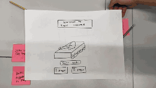
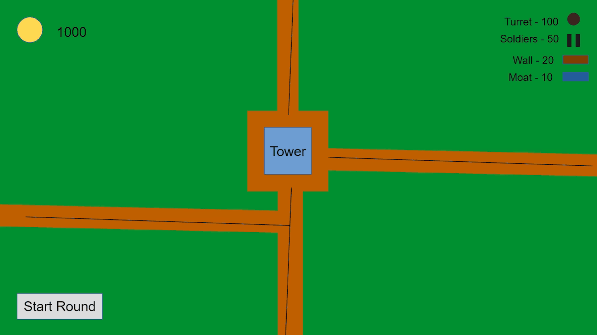

# 2025-group-7
2025 COMSM0166 group 7

## Hex Wars

Link to your game [PLAY HERE](https://uob-comsm0166.github.io/2025-group-7/)

Link to game ideas: [HERE](https://github.com/UoB-COMSM0166/2025-group-7/blob/f06ff86a68514414d8ebfe9873cceb3a018d9c7c/Game-Ideas.txt)

Your game lives in the [/docs](/docs) folder, and is published using Github pages to the link above.

Include a demo video of your game here (you don't have to wait until the end, you can insert a work in progress video)

## Your Group

| Group Member | Name            | Email                          | Role  |
|--------------|-----------------|--------------------------------|-------|
| 1            | Yaseer Alluwaim | ct24605@bristol.ac.uk          | role  |
| 2            | Ajinkya Bhalerao| xi24194@bristol.ac.uk          | role  |
| 3            | Guo Xuanpu      | uw24974@bristol.ac.uk          | role  |
| 4            | Nagat Guled     | dp23022@bristol.ac.uk          | role  |
| 5            | Harry Jackson   | gc24290@bristol.ac.uk          | role  |
| 6            | Haorui Cai      | um24581@bristol.ac.uk          | role  |

## Project Report

### Introduction

- 5% ~250 words 
- Describe your game, what is based on, what makes it novel?

(current word count: 250)

Our game, Hex Wars, is a 2D tank combat game in which players manoeuvre a tank – using forward movement, backward movement, and left/right pivoting instead of lateral movement – around a dynamically generated hex map with the aim of destroying opposing tanks. It can be played in a local two-player “versus” mode, or in a single-player mode against AI bots.

It is based on the browser-based tank combat game Tank Trouble. It shares many of the design principles of the original game, including tank-style movement from a top down perspective and projectile based combat, but differs in a key mechanical aspect: whereas Tank Trouble is largely predicated on geometric reasoning about predictable projectile bounce off of fixed surfaces, Hex Wars creates a more chaotic style of combat by situating the game in a hexagonal grid (about which it is harder to intuitively reason) with destructible walls.

Environmental destructibility means that the arena of combat becomes more and more sparse as gameplay unfolds, pushing players into more proactive and less defensive strategies. It also creates interesting decisions about preserving ammunition and switching to new weapons – with opportunities to reshape the map now balanced against existing concerns about directly damaging the opposing tank.

In addition to the mechanical novelty, we’ve also styled the game in a more consistent futuristic theme with clear applications to graphical assets, sound, and UI design – creating a more coherent aesthetic experience than that offered by Tank Trouble, which simply situates cartoon tanks in an otherwise un-themed game world.

### Requirements 

- 15% ~750 words
- Use case diagrams, user stories. Early stages design. Ideation process. How did you decide as a team what to develop?

- Ideation

Initial ideation was conducted through individual submission of game inspirations through Github. We narrowed the choices down to two core ideas – a tank combat game inspired by Tank Trouble, and a generic Tower Defence game – by simple group voting, which we then confirmed by an in-person meeting.
One common point in support of both options was the scope they offered for innovation on the existing formula, and a feeling that the engineering challenges they offered were correctly pitched for the length of the project.

- Prototyping
  
Both ideas were prototyped during the January 28 workshop, with Tank Trouble prototyped on paper and Tower Defence prototyped via Powerpoint. The team agreed to focus on the Tank Trouble prototype at the outset, indicating an existing common preference for that idea.

After prototyping, the decision was taken to focus on the Tank Trouble idea because of the team’s greater familiarity with the core game mechanics – and because we had already identified some interesting twists on the existing game design that would help differentiate our game from its inspiration.

- Testing Feedback
  
Testing of the paper prototype at the February 6 workshop elicited useful feedback on the design of the game, and some of the engineering challenges we might face.
On game design, some people were confused about the “one hit to kill” philosophy present in the original game – thinking it would make the game too chaotic and might undermine the value of power-ups that enhance the tank’s weapons. Others were unsure of certain ideas about environmental destructibility, highlighting the importance of communicating this information to the player visually.
On engineering, we were warned that a two player game operated from a single keyboard might risk input conflicts, allowing one player to prevent another player from moving by spamming keys and confusing the game. 

- User Stories

When conceptualising requirements, we knew that identifying stakeholders would be an important first step so that we could tailor our requirements to what is necessary and desirable for them in a game.

Fig. X shows our onion model. Directly outside the core video game lie direct stakeholders. These are people responsible for core aspects of game development including developers, UI/UX developers, project managers and the product owner. Developers expect the game to be written according to best practices and accepted standards for improved collaborative efficiency. While project managers expect timely and cost-effective delivery of the game, the product owner (as voice of the customer) expects the game to satisfy end users and will therefore interface closely with user testers. These direct stakeholders rely upon indirect stakeholders (testers, maintainers, future developers) for feedback guiding the sprint process and long-term success of the game. All those involved in development rely upon external stakeholders (including target users, the hosting platform and our lecturers) to validate the game and drive developments post-launch. Finally, the wider environment (ethical bodies, data privacy bodies, library providers, bad agents) is concerned with other aspects which might influence external stakeholders to play (or not play) the game, as well as issues which the product owner must bear in mind at all times.

We took time to consider epics, user stories and acceptance criteria to ensure we kept users at the core of our process. 

Epics:

(1) Game that is comfortable to play for the visually impaired  
(2) Coherent overall design theme to the game  
(3) Intuitive game with guidance for controls  
(4) Game with no bugs or errors and maintainable code  
(5) Taking input from gamers e.g. gamer name and keeping track of state data related to the players e.g. tank health, bullets left  
(6) Management of size and complexity of game to enable running on third party platforms  

We considered the perspectives of a range of stakeholders. 

User Stories and Acceptance Criteria:

-->As a child/inexperienced gamer, I want the game to be playable for me by not being too challenging, so that I enjoy my experience and continue to play in future  
-->Given this is one of my first gaming experiences, when I start playing the game, I want to be able to get through the easiest rounds

-->As a project manager, I want to have a functional game that executes the basic mechanics of this genre, so that players have an experience they can easily understand  
-->Given external users play the game for the first time, when they start playing the game it behaves in a reasonable way, then the game progresses in a way that is intuitive to them

-->As a third party service provider, I want the program uploaded on our server to be compact and render fast, so that users do not have a frustrating experience  
-->Given I uploaded the game on my server, when users try to access them game, I want them to enjoy it even with slow internet

–->As an experienced gamer, I want to have a unique experience, so that the game is distinguished from others  
-->Given I have never played the game before, when I start playing the game for the first time, I want it to be different enough from the original version that I have reason to continue to play

### Design

- 15% ~750 words 
- System architecture. Class diagrams, behavioural diagrams.

(current word count: 525)

The figures below show our UML diagram developed through group discussion in the early project stages. To make the diagram readable and understandable only the high level attributes and methods are shown. Generally speaking attributes have private access and (when needed) are managed through accessor and mutator methods (not shown) providing improved encapsulation and reduced coupling of classes. Methods are often called by other classes hence are mostly public. A key abstraction is that classes often possess `draw()`, `update()` and `remove()` methods. Therefore a bullet or tank is drawn simply by running its `draw()` method. Through providing this standard interface a higher level class does not need to know the details regarding how to draw the lower level object. Shown in yellow are the weapons we initially proposed. All weapon classes inherit from the abstract class Projectile providing concrete implementations of the `draw()`, `update()` and `remove()` methods. Shown in pink are the Tank and Weapon classes. A composition relationship is shown between them since a Tank **has** a Weapon. Further, the Weapon cannot exist without the Tank. The Weapon class also contains static variables such as `bulletCapacity` and `bulletDuration` describing how many bullets the tank can fire and how long bullets last for once fired. In orange is the GameState class which has all game related objects such as the tanks, grid and projectiles. As an example of polymorphism the `projectileList` attribute contains all projectiles currently in play – these can be bombs, bullets, splinters etc. GameState calls their `draw()` and `update()` methods irrespective of what the underlying object type actually is – which also demonstrates clear delegation.

The sequence diagram below illustrates our map generation process. `GameState` initially creates a `Grid` object using the `Grid(GRID_HEIGHT)` constructor. `GameState` then calls the `initGrid` method of `Grid` which creates a hexagonal `Cell` object for every location on the grid. Each `Cell` object stores information such as its location and which walls exist (initially all six walls of each hexagonal cell exist). `GameState` then calls the `initMap` method of `Grid` which generates the map by deleting walls from cells. This algorithm involves assuming a starting location at the top-left of the grid called `current`. There is also a stack of cells called `cellstack` which represents the path the algorithm has followed on the grid. The algorithm starts by calling the `getNeighbours` method of the `current` cell which randomly returns a neighbouring cell from `current` called `next`. If `next` is a valid cell we first push `current` to `cellstack` then we proceed to remove the wall between `current` and `next` by calling `current.removeWall(next)` and increment by setting `current = next`. Otherwise `next` is invalid meaning the path has reached a dead-end and we take a step back in our path by setting `current = cellstack.pop()`. We keep repeating this process until all grid cells have been visited, ensuring no location is inaccessible from another. Finally we call `removeOverlappingWalls` for each `Cell` (which removes any common walls between cells) and `show` (which generates the wall sprite objects). We then return to GameState finishing map generation. This algorithm can generate infinitely many different maps making the game feel different every time.

### Implementation

- 15% ~750 words

- Describe implementation of your game, in particular highlighting the three areas of challenge in developing your game. 

### Evaluation

- 15% ~750 words

- One qualitative evaluation (your choice)
  
We conducted a Heuristic evaluation for the (25th February version) prototype of our game. Due to the game lacking in much of the UI elements we plan to implement, much of the feedback was concerning the tasks we have not yet completed. However, the evaluation was useful in gaining insight on what users value most, and therefore, helped us understand which of our remaining tasks we should prioritise.
System status was the Heuristic that was most frequently mentioned during our evaluation. The issues include, remaining lives, remaining bullets and the effect of damage taken, all not being visible to users. These were also the issues rated with the highest severity by users.
A user experienced initial difficulty in moving the tanks because they rotate left and right rather than move laterally. This is not an uncommon feature in games in which players play as vehicles, and it is a feature we have not changed from the original Tank Trouble game. We have discovered that we may receive feedback that highlights issues that are anticipated in a game similar to ours, and we must carefully consider how much weight we give such feedback.
This evaluation also affirmed that we need to include some form of tutorial that explains the controls of the game, especially as it is developed and more elements are introduced.
Users appreciated the minimalist aesthetic of our game and expressed that it was enjoyable to play. 

- One quantitative evaluation (of your choice)

On the 4th of March we asked 11 participants to complete the NASA TLX for an easy and hard version of our game. In the hard version the player’s tank was slower, they had less ammunition and their health was lower.
Through the NASA TLX, we found that some users actually found it easier to navigate the tank in the hard mode. We realised that beginners will have a much different experience to us, as developers who play the game regularly. This evaluation exposed the obstacle of striking a balance between a challenging, enjoyable game for experienced gamers, and a playable one for inexperienced gamers. 
However, this was not the case for most participants as our results show that there was a statistically significant increased workload when playing the hard mode. Two participants experienced a higher workload, while two participants experienced no observable difference. Therefore, our difficulty modes were generally suitable but they needed fine tuning to ensure this is the case for a wider range of users.

**NASA TLX aggregate scores:**

| Participant | Easy mode  | Hard mode  |
|-------------|------------|------------|
| 1           | 49.17      | 66.67      |
| 2           | 52.50      | 65.83      |
| 3           | 17.50      | 22.50      |
| 4           | 31.67      | 62.50      |
| 5           | 35.00      | 45.83      |
| 6           | 16.67      | 45.00      |
| 7           | 42.50      | 42.50      |
| 8           | 21.67      | 41.67      |
| 9           | 39.17      | 36.67      |
| 10          | 62.50      | 54.17      |
| 11          | 45.00      | 45.00      |

**Wilcoxon Signed-Rank Test Results:**

| Metric             | Value   |
|--------------------|---------|
| W Value            | 4.00    |
| N                  | 11      |
| Confidence Level   | 0.05    |
| Critical W Value   | 5.00    |
| Result             | **Significant**|

- Description of how code was tested. 

### Process 

- 15% ~750 words

- Teamwork. How did you work together, what tools did you use. Did you have team roles? Reflection on how you worked together.

(current word count: 724)

-	Our process
-	
Work was primarily driven by decision making at a weekly touchpoint, conducted in-person between scheduled on-campus lectures.

These sessions functioned as Agile reviews, retrospectives, and sprint planning sessions – at which the team as a whole interacted with the game together, explained their recent work (often with code walkthroughs), and discussed on-going issues with development and potential issues on the horizon.

Agile reviews were conducted, sub-optimally, without the presence of authoritative clients or end-users, and required members of the development team to wear two hats – participating in these meetings as parties responsible for their own recent work, and acting as surrogates for game players in holistic evaluation of the current build. Even though this was not ideal, it did produce beneficial insights for the development of the game – most notably in the mid-development decision to switch the game from a square to a hexagonal grid, in order to increase differentiation from Tank Trouble and make projectile behaviour more interesting.

The team did not implement daily stand-ups since the work was balanced with other commitments on the MSc course, and we chose not to enforce the expectation of daily work on the project that a daily stand-up might imply – instead monitoring progress at our weekly sessions, where issues with overall progress could be addressed if necessary.

Work accelerated during the April vacation period, with all members of the team making themselves broadly available throughout. This led to more regular meetings – including daily sessions during one week of the holiday.

-	Division of work
-	
The team took inspiration from the Extreme Programming principles of collective responsibility for code and a whole team approach to decision-making, and as such strict ownership of parts of the programme was not initiated or enforced – although individual team members did spearhead development of different parts of the programme according to their own interests and strengths.

Development tasks were added to the group Kanban board at our weekly Agile sessions, utilising the in-built project management functionality on Github. The most important tickets for the next week were assigned, and additional tickets in surplus of the most essential work remained in the Kanban backlog for individual team members to pick up as and when capacity permitted – or else were left to be assigned, by agreed order of priority, at the start of a future sprint.

In early sessions, a formal planning poker approach was taken to sizing and prioritising work – but as the project progressed, it was agreed that consensus was easily found within the group on priorities, and that a more informal process could be used to free up extra time for interactive demo and retrospective as a team.

In some instances, pair programming sessions were agreed at weekly meetings to facilitate collaboration across the team – assisting members who had encountered issues in development, or allowing individuals to better understand existing areas of the code that they had not recently worked on.

This formal process was supplemented by ongoing discussion on a group Whatsapp chat so that individuals could update the group on recently committed work, highlight any problems that had arisen in the course of completing tickets, and seek feedback on ideas and decision-making that hadn’t been scoped or settled during the last weekly touchpoint.

-	Rationale

The team followed Agile processes, as an Agile software development lifecycle was considered the correct choice for the project.

Waterfall was rejected because of the opaque requirements of the project, which would be refined along the process rather than set in stone at the outset. Because of the scope of the project a V-shaped SDLC was considered inappropriate, since a sharp delineation between programming and testing was seen to be counterproductive. And a Spiral methodology was also rejected due to the timescale involved in the project – with Agile-style continuous software integration considered more appropriate than repeated discrete iteration.

The choice for Agile was also supported by the circumstances of the project, which allowed us to avoid many of the traditional dangers associated with the approach: it is a greenfield rather than brownfield project, the team is necessarily co-located due to the university context, and term-time availability of the entire team was very predictable. There was also no firm contractual relationship required by the project, with the requirements set by the unit remaining fairly loose – supporting an Agile approach to development and an ongoing discovery process.

### Sustainability, ethics and accessability 

- 10%, 750 words
- Evidence of the impact of your game across the environment and two of the other areas (Social, Economic, Technical and Individual)

(current word count: 645)

It is vital to consider sustainability throughout the software development process. The information and Communication Technologies (ICT) sector is responsible for approximately 2% of global carbon emissions (Danushi, Forti, & Soldani, 2024).

Our sustainability awareness diagram is shown below. The diagram was created following a team-based discussion of the Sustainability Awareness Framework topics and represents the issues considered most important in terms of likelihood and impact. The game consumes server lifetime and (because a keyboard is needed to play) promotes PC usage which may be less energy efficient than tablet or phone usage. Furthermore the game promotes a culture of PC gaming (which is associated with high-volume consumption of components such as GPUs and RAM) and therefore shares some of the collective responsibility of the WEEE waste produced by the PC gaming industry. On the other hand the game has lower energy consumption compared to typical PC games (owing to its simplistic design) and runs locally on the client machine – reducing energy consumption caused by network data usage in many other online PC games. The game also uses the P5 Play physics library which provides optimised implementations of numerous common game entities thereby making our code more efficient. Finally the game does not include in-game purchases or upgrades which can be considered exploitative (and which many online games possess).

Our game impacts individual sustainability by encouraging strategic thinking and improved coordination skills. Research shows that a sufficient level of simultaneous information and action coordination in a video game can lead to improved cognitive flexibility (Glass, Maddox, & Love, 2013). Our game requires the player to learn how to navigate the tank, pick up collectables and avoid and attack their opponent, among other tasks. As well as this, the added twist of breakable walls provides another complex element to the game. Therefore, our game rewards more strategic players as they can choose which features of our game to use to their advantage. 

Furthermore, in the initial stages of implementation, our game had a red and green theme. The colours of our two tanks in both modes were a bright red and green. At this time, we felt that these colours were easy to locate, and fit our minimalist theme. However, during a guest talk by Doug Clark on designing for accessibility we found that these colours were the most problematic for colour blind people. This would make the tanks difficult to distinguish, and greatly impact the usability and enjoyability of playing the game for such users. Due to this, we chose to not only change the colours of the tanks, but allow the user to be able to choose and customise colours. This makes our game more individually sustainable as it allows our game to be accessible to a more diverse demographic of users. It also enhances the playability of our game to non-color blind players as they are able to choose the colours that bring the most comfort to their playing experience.

In our discussion, concerns were raised regarding sedentary lifestyles and gaming addictions causing lesser connections with nature. The glorification of conflict and warfare may normalise such concepts within impressionable minds such as children. The general aggression model suggests that exposure to violent video games can cause people to behave impulsively and aggressively (Adachi & Willoughby, 2011). However, we have purposefully designed our game to be of a futuristic and virtual style. The game is not intended to simulate reality, rather the warfare theme serves as a foundation to introduce many different components (e.g. weapons). 
In future, we can develop a cooperative multiplayer mode in order to encourage social sustainability. Research suggests that the cooperative game mode could weaken the effect of violent video games (Zheng et al., 2021). Our game may positively impact social sustainability in its current form as competitive game modes have been found to stimulate more shared laughter (Zhan et al., 2022). 

### Conclusion

- 10% ~500 words

- Reflect on project as a whole. Lessons learned. Reflect on challenges. Future work. 

### Contribution Statement

- Provide a table of everyone's contribution, which may be used to weight individual grades. We expect that the contribution will be split evenly across team-members in most cases. Let us know as soon as possible if there are any issues with teamwork as soon as they are apparent. 

### Additional Marks

You can delete this section in your own repo, it's just here for information. in addition to the marks above, we will be marking you on the following two points:

- **Quality** of report writing, presentation, use of figures and visual material (5%) 
  - Please write in a clear concise manner suitable for an interested layperson. Write as if this repo was publicly available.

- **Documentation** of code (5%)

  - Is your repo clearly organised? 
  - Is code well commented throughout?
